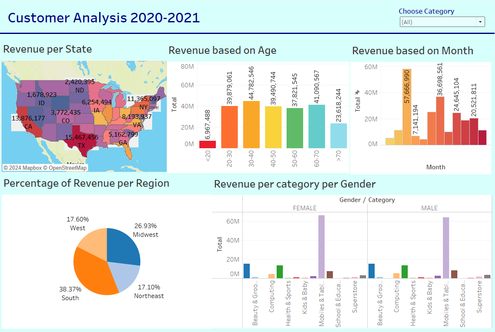

# Customer Analysis 2020-2021

This Tableau project provides a detailed analysis of customer data from 2020 to 2021, 
focusing on key revenue metrics by state, age, gender, and more. The interactive dashboards present insights into customer 
demographics, sales trends, and regional performance, allowing businesses to make data-driven decisions.

## Project Overview
This project is designed to provide insights into customer behavior, purchasing patterns, and revenue breakdowns. 
The analysis covers the years 2020 and 2021 and includes multiple dimensions such as geography, age, gender, and time.

## Dataset

The dataset includes:
Customer demographic information (age, gender, region).
Sales data (revenue by category, month, and state).
The analysis provides business leaders with a better understanding of how different customer segments contribute to total sales and revenue over time.

## Key Features

* Revenue Breakdown by State: Visualizes total revenue generated by each state on a U.S. map.
* Revenue by Age Group: Shows revenue distribution across different age groups, helping identify key customer demographics.
* Monthly Sales Trends: Displays revenue changes month-over-month for 2020 and 2021.
* Regional Revenue Distribution: Pie chart showing the percentage of revenue contributed by each region.
* Category and Gender Comparison: Compares revenue by product category for male and female customers.

## Usage
* Open the Tableau workbook (Customer Analysis 2020-2021.twb) in Tableau Desktop.
* Dataset is obtained from Kaggle
* Explore the interactive dashboard to:
  - Filter by product category, state, gender, or time.
  - Analyze revenue patterns and identify key drivers of growth.
  - Compare customer segments and geographical regions.

## Dashboard Overview

* Revenue per State: A U.S. map that visualizes total revenue per state. Larger values are highlighted with deeper colors, providing an easy way to identify top-performing states (e.g., California, Texas, and New York).
* Revenue by Age Group: A bar chart showing how different age groups contributed to total revenue. The analysis shows that customers aged 30-50 have the highest purchasing power.
* Monthly Revenue: A month-by-month revenue breakdown helps identify peak months for sales. For instance, the highest revenue is seen in the month of June.
* Revenue by Region: A pie chart dividing the total revenue by region (e.g., South, Midwest, West, and Northeast), with the South leading in overall contribution.
* Revenue by Category and Gender: A bar chart comparing the purchasing patterns of male and female customers across various product categories, such as Mobiles & Tablets, Kids & Baby, and Health & Sports.

